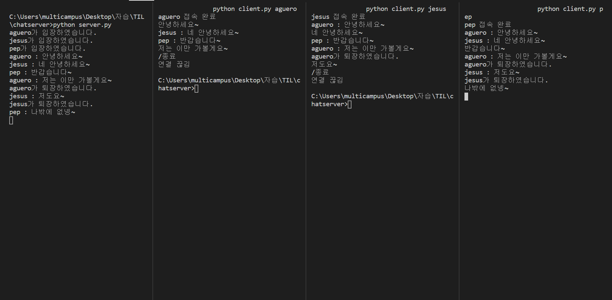

오늘은 모 회사 면접에서 멀티 스레드에 대한 질문이 들어왔지만 운도 떼지 못한게 너무 아쉬워서 멀티 스레드를 이용한 채팅 서버를 만들어 보겠습니다.

우선 채팅 서버를 만들기 위해서는 `소켓`과 `스레드`라는 개념이 필요합니다.

소켓과 스레드에 대해서 간단히 알아만 보고 가겠습니다.

## 소켓

네트워크 상에서 클라이언트와 서버가 서로 통신을 가능하게 해주는 장치 이다. 

## 스레드

프로세스 행위의 단위로써 2가지 이상의 스레드를 이용하는것을 멀티 스레드라 합니다.


### server.py

```python
from socket import *
import threading

port = 10000

server_socket = socket(AF_INET, SOCK_STREAM) ## 소켓을 정의합니다.
server_socket.bind(('', port))               ## 서버가 정해진 포트번호로 지정된 소켓을 생성합니다.
server_socket.listen(5)                      ## 최대로 들어올 수 있는 소켓 갯수를 지정합니다.

user_list = {}                               ## 채팅 유저관리를 위한 딕셔너리입니다.
def receive(client_socket, addr, user):
    while 1:                                 
        data = client_socket.recv(1024)      ## 클라이언트 소켓에서 데이터를 받아 옵니다.
        string = data.decode()               ## 받아온 데이터는 비트로 인코딩 되있기 때문에 디코딩을 해줍니다. 

        if string == "/종료" :                           
            msg = f'{user.decode()}가 퇴장하였습니다.'
            for con in user_list.values():                    
              try:
                  con.sendall(msg.encode())
              except:
                  print("연결이 비 정상적으로 종료된 소켓 발견")
            print(msg)
            break
        string = "%s : %s"%(user.decode(), string)
        print(string)
        for con in user_list.values():                    ## 채팅에 참여하고 있는 클라이언트들에게 받아온 메시지 전달
            try:
                con.sendall(string.encode())            
            except:
                print("연결이 비 정상적으로 종료된 소켓 발견")
    del user_list[user]                                   ## 채팅서버를 나간 클라이언트는 딕셔너리에서 제거
    client_socket.close()                                 ## 클라이언트 소켓 제거

while True:
    client_socket, addr = server_socket.accept()          ## 클라이언트 소켓 정의
    user = client_socket.recv(1024)                       ## 처음 클라이언트 소켓이 정의되고 난 후 처음 받는 데이터
                                                          ## 클라이언트는 채팅 유저의 이름을 보냅니다.
    user_list[user] = client_socket                       ## 유저 리스트에 유저 추가
    print(f'{user.decode()}가 입장하였습니다.')          

    receive_thread = threading.Thread(target=receive, args=(client_socket, addr,user))
    ## 각각의 클라이언트 서버가 채팅을 따로 치기 위해 각 클라이언트로 부터 데이터를 받고 보내는 부분은 스레드로 정의해줍니다.
    receive_thread.start()
```


### Client.py

```python
from socket import *
import argparse
import threading

client_socket = socket(AF_INET, SOCK_STREAM)  
client_socket.connect(('127.0.0.1', 10000))    ## 로컬에서 진행하기 때문에 로컬 주소와 지정된 포트번호로 소켓 생성

parser = argparse.ArgumentParser()             ## 파서를 통해 클라이언트의 이름을 지정할 수 있도록 정의
parser.add_argument('user')
args = parser.parse_args()
user = args.user

print(f'{user} 접속 완료')

def handle_receive(client_socket, user):       ## 서버로 부터 데이터를 받는 함수
    while 1:
        try:
            data = client_socket.recv(1024)    ## 서버로 부터 데이터가 온다면 데이터를 프린트하고 오지 않는 다면 
                                               ## 서버로부터 연결이 끊겼음을 프린트
        except:
            print("연결 끊김")
            break
        data = data.decode()
        if not user in data:
            print(data)

def handle_send(client_socket, user):          ## 서버로 데이터를 전달
    while 1:
        data = input()
        client_socket.sendall(data.encode())
        if data == "/종료":
            break
    client_socket.close()


receive_thread = threading.Thread(target=handle_receive, args=(client_socket, user,))
receive_thread.start()
send_thread = threading.Thread(target=handle_send, args=(client_socket, user))
send_thread.start()
## 데이터를 보내는 것과 받는 것을 멀티 스레드로 지정하여서 서로 각 각 동작할 수 있도록 합니다.

client_socket.sendall(user.encode()) ## 클라이언트 소켓이 정의 된 후 보내는 첫 데이터 유저의 이름을 보냅니다.
```


### 멀티스레드가 필요한 이유

클라이언트에서 데이터를 보내는 것과 받는 것을 멀티 스레드로 지정하지 않는다면 내가 채팅을 한 번 친다면 무조건 한 번 받은 후에 다시 쳐야한다. 그렇게 된다면 진정한 의미의 채팅이라고 할 수 없다. 

채팅을 보내는 것과 받는 것을 멀티 스레드로 지정함으로써 자유롭게 이야기를 나눌 수 있게 된 것이다.

### 채팅 서버 시연



> 맨 왼쪽이 서버이고 오른쪽 3개가 각 각의 클라이언트 입니다.

### 참고사이트

https://sungmin-joo.tistory.com/60

https://sungmin-joo.tistory.com/61?category=863420

